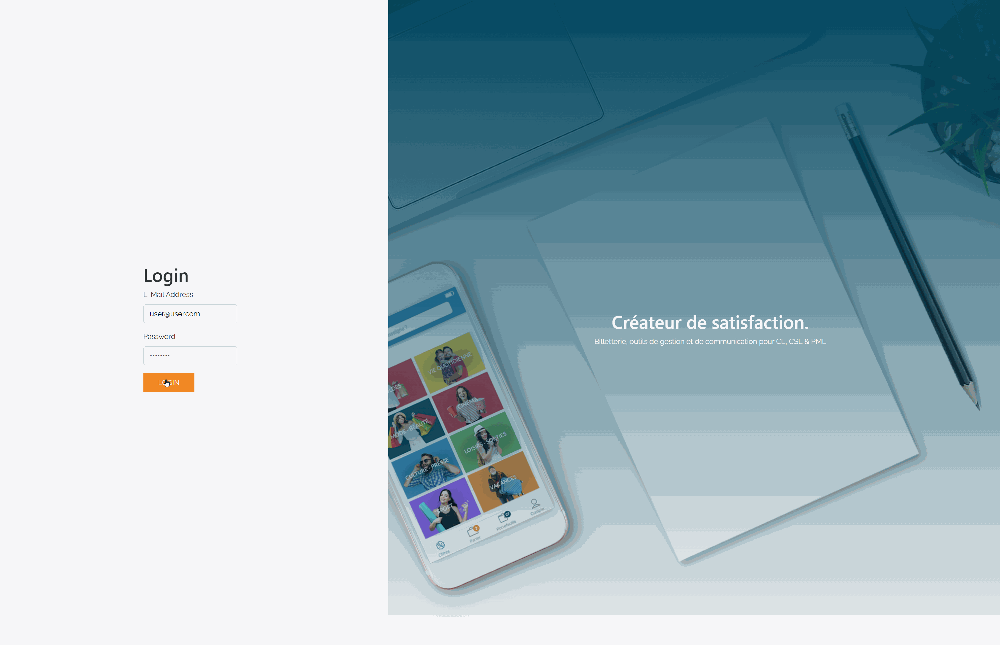

# Réalisation d'un projet pour HelloCSE
## Création
#### Étape 1 : Estimation du temps et réflexion
Je commence à estimer la charge de travail, et en profite pour me faire une idée de la structure de DB, les fonctionnalités nécessaire et un UX/UI adapté. 

Estimation : 2 jours

Découpage : Jour 1 
- Installation du projet
- Mise en place d'un MVC, CRUD avec Seeder et création des routes nécessaires

Découpage : Jour 2
- Création du backoffice : traitement des données avec VueJS et traitement des erreurs
- Création de la visualisation : stylisation de la page, responsive et vérification du dev

Je décide de partir sur un projet GitHub offrant déjà un système d'inscription / connexion, notamment pour 2 raisons : 
- Il est inutile de réinventer la route, beaucoup de fonctionnalités fonctionnant très bien existent déjà, je n'aurais pas à le refaire
- Il est rare de créer un projet "from scratch", même avec un framework, autant en profiter pour me plonger dans un projet que je ne connais pas et m'y adapter

#### Étape 2 : Mise en place et installation du projet
Après avoir créé un projet et modifié certains éléments qui ne changeront plus, je le versionning afin de pouvoir avoir un suivi de mon avancement par la suite et créé une branche de dev pour développer dessus. Étant seul, je ne fais pas une autre branche liée au ticket car pas nécessaire dans ce cas.

## Améliorations envisagée
  * Mieux gérer le nommage, notamment : firstName VS first_name
  * Factoriser le validator
  * Traiter les cas ou la liste de star est vide en front
  * Supprimer plusieurs sorties avec les checkbox
  * Mettre en place plus de traduction, notamment pour les erreurs

## Instructions d'installation

Remarque : 
Dans le dossier "files" contient les ressources du projet en cas de problème d'installation :
- Le ZIP du projet
- La DB au format .sql
- Le GIF du rendu final

Les commentaires les plus pertinents contiennent "COMMENT HELLOCSE" pour simplifier les recherches

Version : 

- Laravel : 8.22.0
- Node : v14.15.4

Identifiants : 

- user@user.com / password

Installation : 

1. Exécuter `git clone https://github.com/ambrymaxime/emploi-test.git hellocse_test`
2. Créer une base de donnée MySQL nommée "hellocse_test"
3. Créer un fichier d'environnement : `cp .env.example .env` et modifier les optino de DB
4. Configurer le fichier `.env`
```
DB_CONNECTION=mysql
DB_HOST=127.0.0.1
DB_PORT=3306
DB_DATABASE=hellocse_test
DB_USERNAME=root
DB_PASSWORD=
```
5. Exécuter `composer update` depuis la base du projet
6. Exécuter ensuite :
```bash
php artisan vendor:publish --tag=laravelroles &&
php artisan vendor:publish --tag=laravel2step
```
8. Depuis la base du projet, exécuter `php artisan key:generate`
9. Depuis la base du projet, exécuter `php artisan migrate`
10. Depuis la base du projet, exécuter `composer dump-autoload`
11. Depuis la base du projet, exécuter `php artisan db:seed`

12. Lancez le serveur `php artisan serve`
13. Compilez ensuite le front : `npm install`
14. Compilez ensuite le front : `npm run dev` ou `npm run watch`

